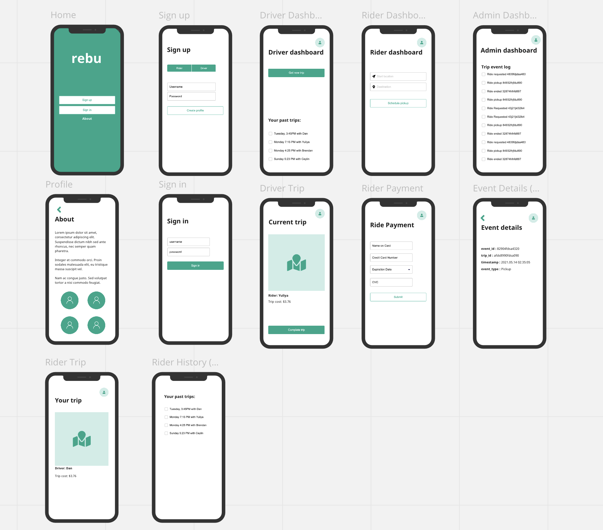
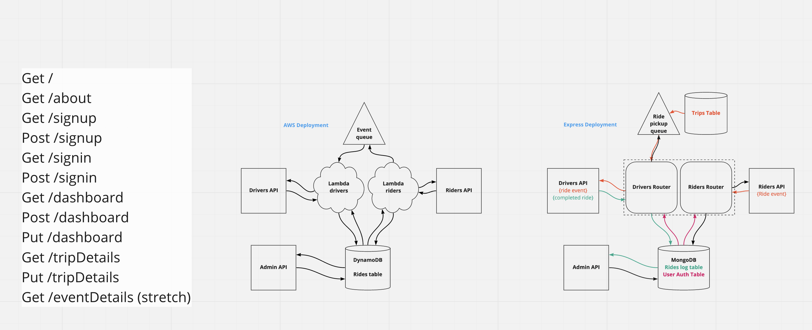
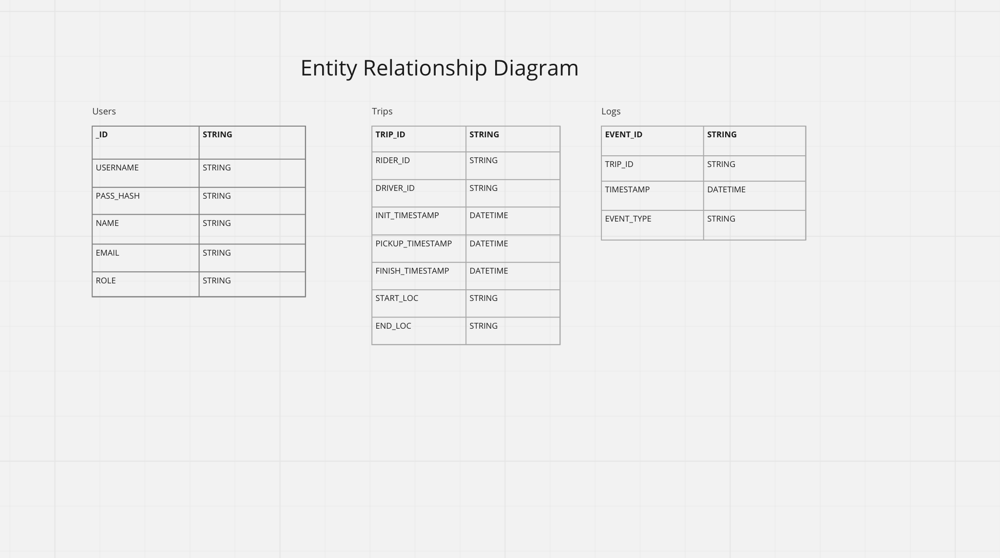

# RebuNative

## Authors: Ceylin Brooks, Brendan Smith, Yuliya Barysevich, Dan Engel
___

## Vision

TThe vision for this project is to allow users to request rides, drivers to accept those ride requests and complete a ride share.

Users in need of transportation can utilize this app to go to different destinations.

This solves the issue of having to worry about getting from point A to point B. It also ensures that users are not stuck at a location or using dated services as a mode of transportation.

___

## Scope (In/Out)

***IN SCOPE- What will REBU do?***

- Allow users to request to be picked up from a location.
- Will allow drivers to accept and complete rides.
- Will allow user authentication via sign-up or sign-in.
- Will allow users to sign up as a Rider or Driver.

***OUT OF SCOPE- What will your product not do?***

- Will not be a food delivery application.
- Will not 

### Minimum Viable Product

- Authorize sign-up/sign-in for Rider, Driver and Admin
- Riders can equest a pickup
- Driver has the ability to pull ride requests from the queue
- Ride complete button(function)
- Admin log-in : to review requested/completed rides(log)
- Database- completed ride logged && rider requests

### Stretch Goals

- Deploy with AWS
- Schedule return pick-up
- Time travel ride share
- Admin Dashboard w/ trip details
- Ride history
- Live map integration

### Non-Functional Requirements

- Usability: Our app makes it simple for a user to request a ride after either creating a new account or logging into an exising account. The simple interface allows the user to request a ride with minimal options as to cut out the confusion of ride requests. The user also have clearly labeled buttons for login, log out and ride requesting.

- Reliability: The app ensure that the user has a mode of transportion, with drivers availiable for rides 24/7. The will undergo testing to ensure it maintians its functinality. To miniize any downtime that user may experience the app will hae regular updates to patch in break in database or server communication.

___

## User Stories

1. **As a new user (driver/user) I want to be able to create my own profile and save it, so I don’t have to sign up every time**
    - Feature Tasks:
      - User can create account with unique username and password.
      - The username and password have to be saved to data base.
    - Acceptance Test:
      - After entering a unique username and password, account creation success message pops up
      - Ensure user can sign in with the same username and password

2. **As a rider, I want to alert the system when I need a new ride**
    - Feature Tasks:
      - Rider can request a new ride using his current location and requesting destination.
      - Request is sent to “ride pick up queue”.
    - Acceptance Test:
      - User is able to provide information about his current location
      - User is able to provide information about his destination
      - After request is made, rider gets a message with estimate arrival time of driver.

3. **As a rider, I want to have ability to determine my current location** 
    - Feature Tasks:
      - Rider can allow access to his current location.
      - Rider can deny access to his current location 
    - Acceptance Test:
      - Ensure location is determined correctly

4. **As a driver, I want to be able to get notified when there is a new trip request.**
    - Feature Tasks:
      - Driver gets notified if there is request for a new ride.
      - Driver is able to accept a request for a new ride.
      - Driver is able to reject a request for a new ride
      - Driver is able to see details of upcoming ride (rider’s name, pick up and drop off locations)
    - Acceptance Test:
      - Driver is able to see all requests in “ride pick up queue”

5. **As an administrator, I want to be able to monitor general events (ride request, ride pick up, ride ended)**
    - Feature Tasks:
      - Administrator gets notified when there is a new request for a ride.
      - Administrator gets notified when driver accept a request from a rider.
      - Administrator gets notified when trip is ended
    - Acceptance Test:
      - Administrator is able to see all information about trip (rider’s name, driver’s name, pick up location, drop off location)
      - Only administrator with proper role assigned (‘admin’) can have access to this information 

___

## Diagrams and UML

